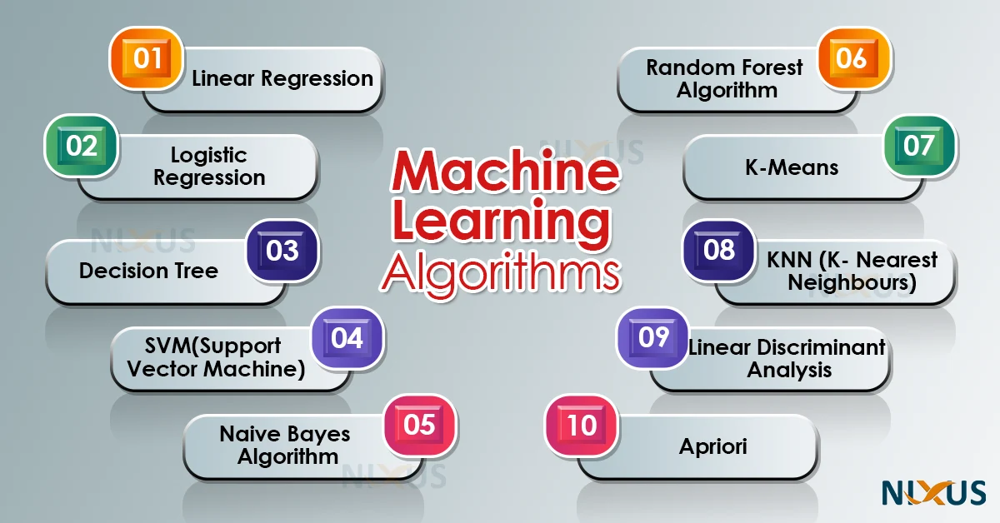

# Machine-Learning-Research

This repository is dedicated to my own research about machine learning algorithms to investigate how they work and implement them from scratch using `numpy`.

For high-level neural networks and deep learning models, I use [Tensorflow](https://github.com/tensorflow/tensorflow) and [PyTorch](https://github.com/pytorch/pytorch) libraries instead.

